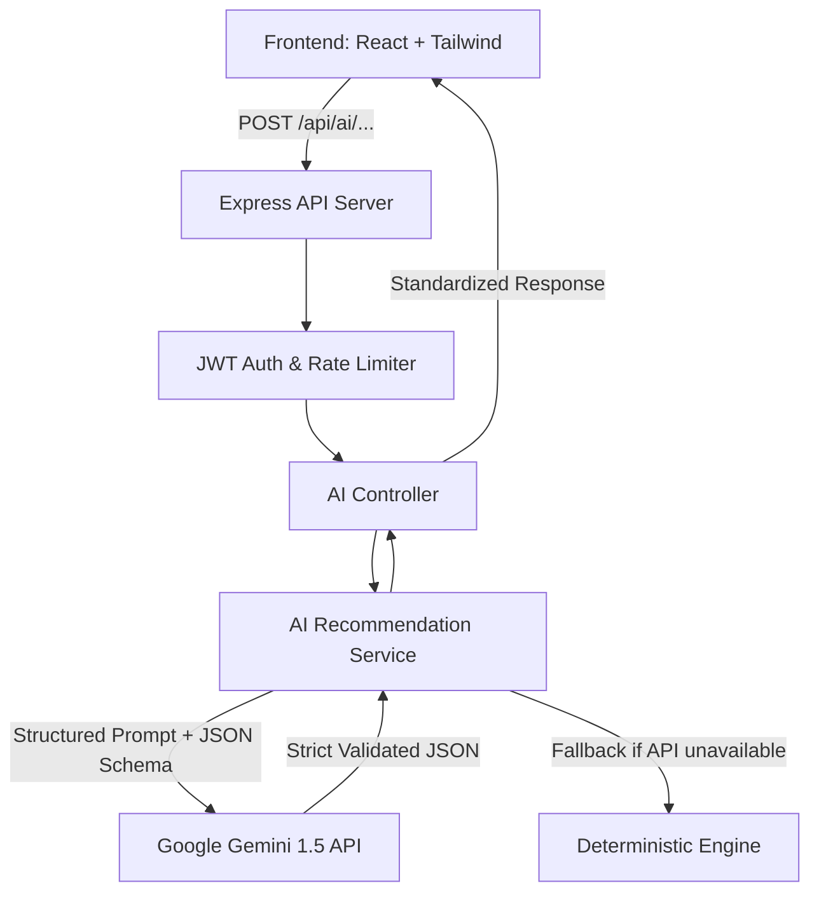

# 🤖 GlobeTrotter AI Recommendation API Service Design

This document details the complete design of the **AI / Smart Recommendation Engine** for GlobeTrotter using the **Google Gemini API** (`gemini-1.5-flash` / `gemini-1.5-pro`). It includes prompt engineering strategies, strict JSON output schemas, endpoint specifications, and error-handling mechanisms.

---

## 🏗️ 1. Architecture Overview



---

## 🎯 2. Prompt Engineering Strategy

### A. System Instruction
```text
You are GlobeTrotter's Senior AI Travel Curator and Itinerary Architect. 
Your role is to craft realistic, highly personalized, culturally immersive, and budget-optimized travel plans.
Key Guidelines:
1. Always respect user budget limits, group dynamics (Solo, Couple, Family, Friends), and trip pace.
2. Group activities by geographical proximity to minimize transit time.
3. Include estimated costs in INR (₹) and exact timing (24-hour HH:MM format).
4. Provide insider local tips, authentic culinary hotspots, and cultural etiquette.
5. Return ONLY valid JSON adhering strictly to the provided response schema.
```

### B. Gemini API Configuration Parameters
- **Model**: `gemini-1.5-flash` (for fast interactive recommendations) / `gemini-1.5-pro` (for deep multi-city itineraries)
- **Temperature**: `0.3` (Low randomness for realistic travel times, accurate costs, and schema adherence)
- **TopP**: `0.85`
- **TopK**: `40`
- **Response MIME Type**: `application/json`
- **Response Schema**: Defined via Gemini `responseSchema` (OpenAPI 3.0 / JSON Schema specification)

---

## 📡 3. API Endpoints & Structured JSON Schemas

---

### Endpoint 1: Generate Full Smart Itinerary
* **Method & Route**: `POST /api/ai/generate-itinerary`
* **Purpose**: Generates a day-by-day itinerary tailored to user style, interests, duration, budget, and group type.

#### Request Body
```json
{
  "destination": "Goa",
  "days": 4,
  "budget": 35000,
  "travelers": 2,
  "travelStyle": "Balanced Explorer",
  "interests": ["Beach", "Culture", "Seafood", "Nightlife"],
  "pace": "Moderate",
  "groupType": "Couple",
  "dietaryPreference": "Non-Vegetarian"
}
```

#### Gemini Prompt Template
```text
Generate a comprehensive {days}-day travel itinerary for {destination}.
- Budget: ₹{budget} INR total for {travelers} traveler(s) ({groupType})
- Travel Style: {travelStyle}
- Pace: {pace}
- Interests: {interests.join(', ')}
- Dietary: {dietaryPreference}

Create a realistic daily schedule with 2-4 curated activities per day, optimal transit sequences, exact budget allocations, packing essentials, and prep checklist.
```

#### Gemini `responseSchema` (JSON Schema)
```json
{
  "type": "OBJECT",
  "properties": {
    "title": { "type": "STRING" },
    "summary": { "type": "STRING" },
    "destination": { "type": "STRING" },
    "durationDays": { "type": "INTEGER" },
    "travelers": { "type": "INTEGER" },
    "totalEstimatedCost": { "type": "NUMBER" },
    "budgetBreakdown": {
      "type": "OBJECT",
      "properties": {
        "accommodation": { "type": "NUMBER" },
        "transportation": { "type": "NUMBER" },
        "food": { "type": "NUMBER" },
        "activities": { "type": "NUMBER" },
        "shopping": { "type": "NUMBER" },
        "contingency": { "type": "NUMBER" }
      },
      "required": ["accommodation", "transportation", "food", "activities", "shopping", "contingency"]
    },
    "days": {
      "type": "ARRAY",
      "items": {
        "type": "OBJECT",
        "properties": {
          "dayNumber": { "type": "INTEGER" },
          "theme": { "type": "STRING" },
          "cityName": { "type": "STRING" },
          "weatherPreview": {
            "type": "OBJECT",
            "properties": {
              "condition": { "type": "STRING" },
              "tempC": { "type": "NUMBER" },
              "icon": { "type": "STRING" }
            },
            "required": ["condition", "tempC", "icon"]
          },
          "activities": {
            "type": "ARRAY",
            "items": {
              "type": "OBJECT",
              "properties": {
                "activityId": { "type": "STRING" },
                "title": { "type": "STRING" },
                "category": { "type": "STRING" },
                "timeSlot": { "type": "STRING" },
                "durationMinutes": { "type": "INTEGER" },
                "estimatedCost": { "type": "NUMBER" },
                "location": { "type": "STRING" },
                "description": { "type": "STRING" },
                "insiderTip": { "type": "STRING" },
                "isIndoor": { "type": "BOOLEAN" },
                "tags": {
                  "type": "ARRAY",
                  "items": { "type": "STRING" }
                }
              },
              "required": ["activityId", "title", "category", "timeSlot", "durationMinutes", "estimatedCost", "location", "description"]
            }
          }
        },
        "required": ["dayNumber", "theme", "cityName", "activities"]
      }
    },
    "packingList": {
      "type": "ARRAY",
      "items": {
        "type": "OBJECT",
        "properties": {
          "name": { "type": "STRING" },
          "category": { "type": "STRING" },
          "quantity": { "type": "INTEGER" },
          "essential": { "type": "BOOLEAN" }
        },
        "required": ["name", "category", "quantity", "essential"]
      }
    }
  },
  "required": ["title", "summary", "destination", "durationDays", "budgetBreakdown", "days", "packingList"]
}
```

---

### Endpoint 2: Personalized Destination & Experience Discovery
* **Method & Route**: `POST /api/ai/personalized-recommendations`
* **Purpose**: Generates curated destination cards or experiences matching the user's personality profile & vibe.

#### Request Body
```json
{
  "userPersona": {
    "vibes": ["Heritage", "Street Food", "Photography"],
    "budgetTier": "Moderate",
    "preferredPace": "Relaxed",
    "startingCity": "Ahmedabad",
    "travelRadius": "Domestic (India)"
  },
  "limit": 4
}
```

#### Gemini `responseSchema` (JSON Schema)
```json
{
  "type": "OBJECT",
  "properties": {
    "personaSummary": { "type": "STRING" },
    "recommendations": {
      "type": "ARRAY",
      "items": {
        "type": "OBJECT",
        "properties": {
          "destinationId": { "type": "STRING" },
          "name": { "type": "STRING" },
          "stateOrCountry": { "type": "STRING" },
          "matchScore": { "type": "INTEGER" },
          "highlight": { "type": "STRING" },
          "idealDuration": { "type": "STRING" },
          "estimatedBudgetPerPerson": { "type": "NUMBER" },
          "bestTimeToVisit": { "type": "STRING" },
          "accentColor": { "type": "STRING" },
          "topExperiences": {
            "type": "ARRAY",
            "items": { "type": "STRING" }
          },
          "tags": {
            "type": "ARRAY",
            "items": { "type": "STRING" }
          }
        },
        "required": ["destinationId", "name", "matchScore", "highlight", "idealDuration", "estimatedBudgetPerPerson", "topExperiences", "tags"]
      }
    }
  },
  "required": ["personaSummary", "recommendations"]
}
```

---

### Endpoint 3: Smart Activity Swap & Weather Adaptive Replacement
* **Method & Route**: `POST /api/ai/swap-activity`
* **Purpose**: Replaces an activity due to weather change, user preference, or closure while maintaining itinerary flow.

#### Request Body
```json
{
  "currentActivity": {
    "title": "Baga Beach Water Sports",
    "category": "Adventure",
    "durationMinutes": 120,
    "cost": 1500,
    "location": "North Goa"
  },
  "reason": "Sudden heavy rain",
  "destination": "Goa",
  "userInterests": ["Culture", "Food", "Relaxation"]
}
```

#### Gemini `responseSchema` (JSON Schema)
```json
{
  "type": "OBJECT",
  "properties": {
    "reasonAlert": { "type": "STRING" },
    "alternatives": {
      "type": "ARRAY",
      "items": {
        "type": "OBJECT",
        "properties": {
          "title": { "type": "STRING" },
          "category": { "type": "STRING" },
          "durationMinutes": { "type": "INTEGER" },
          "estimatedCost": { "type": "NUMBER" },
          "location": { "type": "STRING" },
          "description": { "type": "STRING" },
          "isIndoor": { "type": "BOOLEAN" },
          "whyRecommended": { "type": "STRING" }
        },
        "required": ["title", "category", "durationMinutes", "estimatedCost", "location", "description", "isIndoor", "whyRecommended"]
      }
    }
  },
  "required": ["reasonAlert", "alternatives"]
}
```

---

### Endpoint 4: AI Budget Optimizer
* **Method & Route**: `POST /api/ai/optimize-budget`
* **Purpose**: Analyzes existing itinerary costs vs. user target budget and generates smart reallocation tips.

#### Request Body
```json
{
  "destination": "Jaipur",
  "targetBudget": 30000,
  "currentEstimatedCost": 42000,
  "durationDays": 4
}
```

#### Gemini `responseSchema` (JSON Schema)
```json
{
  "type": "OBJECT",
  "properties": {
    "targetBudget": { "type": "NUMBER" },
    "currentEstimatedCost": { "type": "NUMBER" },
    "potentialSavings": { "type": "NUMBER" },
    "optimizedTotal": { "type": "NUMBER" },
    "strategies": {
      "type": "ARRAY",
      "items": {
        "type": "OBJECT",
        "properties": {
          "category": { "type": "STRING" },
          "title": { "type": "STRING" },
          "description": { "type": "STRING" },
          "estimatedSavings": { "type": "NUMBER" },
          "impactOnExperience": { "type": "STRING" }
        },
        "required": ["category", "title", "description", "estimatedSavings", "impactOnExperience"]
      }
    }
  },
  "required": ["targetBudget", "currentEstimatedCost", "potentialSavings", "optimizedTotal", "strategies"]
}
```

---

## 🛡️ 4. Resilience & Error Handling Strategy

1. **Structured Outputs Mode (`responseMimeType: "application/json"`)**: Enforces pure JSON output from Gemini without markdown backticks (```json).
2. **Schema Validation & Fallback Parser**: If Gemini fails to respond or exceeds rate limits, the service transparently switches to the deterministic algorithmic generator.
3. **Response Sanitization**: Ensures every numerical property is properly cast and defaults are injected if missing.
4. **Timeout Guardrails**: Set a 12-second timeout on LLM calls to prevent hanging connections.
